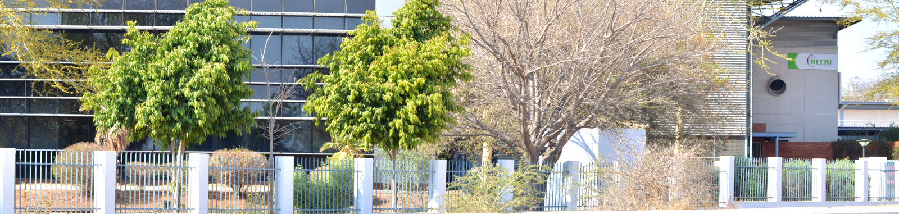

{width="100%"}

# Overview

Technology plays an important role in streamlining education system in today‘s fast growing academic environments where there is a need to manage and maintain data over a long period of time. BITRI has embarked in a journey to develop a multi-domain (Primary, Junior and High Schools network based school management system aimed at computerizing school records and providing a convenient platform for administrators and teachers to access and manipulate school and student records, thus improving service delivery in an academic environment. 

!!! success ""
    The system will also provide a platform which facilitates staff-to-staff and teacher-to-parent communication where teachers can share student reports and send emails concerning students performance and disciplinary records.

-   :material-clock-fast:{ .lg .middle } __Set up in 5 minutes__

    ---

    Install [`mkdocs-material`](#) with [`pip`](#) and get up
    and running in minutes

    [:octicons-arrow-right-24: Getting started](#)

-   :fontawesome-brands-markdown:{ .lg .middle } __It's just Markdown__

    ---

    Focus on your content and generate a responsive and searchable static site

    [:octicons-arrow-right-24: Reference](#)

-   :material-format-font:{ .lg .middle } __Made to measure__

    ---

- [x] Lorem ipsum dolor sit amet, consectetur adipiscing elit
- [ ] Vestibulum convallis sit amet nisi a tincidunt
    * [x] In hac habitasse platea dictumst
    * [x] In scelerisque nibh non dolor mollis congue sed et metus
    * [ ] Praesent sed risus massa
- [ ] Aenean pretium efficitur erat, donec pharetra, ligula non scelerisque

