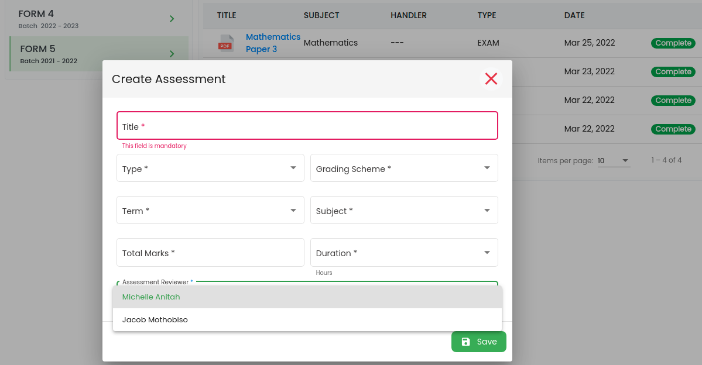
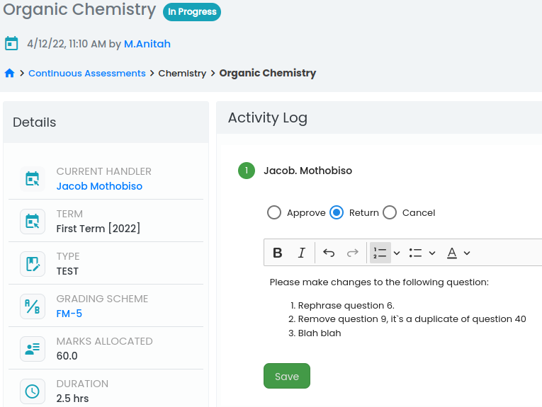
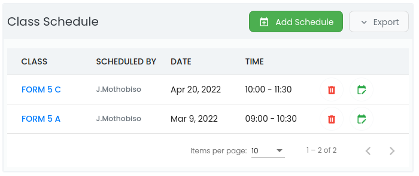
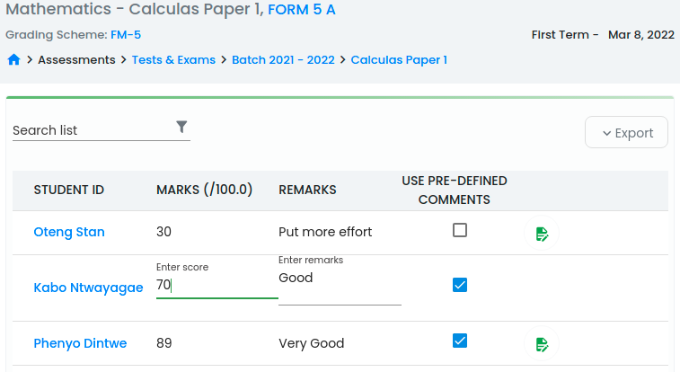

# Student Assessments

Quick and easy tracking of student assessments and results.

## Features

- [x] **`Create different types of assessments`**.
    The current implementation support assessment of type Exams, Tests, Mock Exams and Quizzes.To create an assessment, go to **`Tests & Exams`**, select batch from a list of active batches then click **`Create`**.

    {width="100%"}

    * [ ] By selecting a reviewer when creating an assessment automatically triggers the start of an approval process.` Assessment reviewers are system users with the privilege to approve assessments`. 

    * [ ] Once assessment has been created, it become available in a list of `in progress` assessment. Click on assessment name to view its details and if you are the designated handler, you will be prompted to either approve return to creator or cancel with comments as depicted below.

    {width="100%"}

    * [ ] Exams are created at system admin level by a privileged user and the approval process is within this level of access, whereas other types of assessments are created at school level.

    * [ ] Contrary to other  assessments, which are specific to school, exams are made available to all schools under your administration once approval process has been completed.

- [x] **`Schedule assessment for classes`**.
Once approval process is complete, privileged users can now schedule assessments for classes. Class schedule will appear on a list of assessment class schedules as depicted below

{width="100%"}

- [x] **`Record student marks`**.
After student has written the assessment on the sheduled date, teachers will now capture student marks back into the system. Click on class name on a list of scheduled classes and you will be presented with a view below:

{width="100%"}

* [ ] The view presents an extreamly user-friendly interface for adding and updating student marks. It supports custom user remarks when updating student marks. 

- [x] **`Custom Grading Schemes`**.
Users can define custom grading scheme to suit the school policies. Once defined, the grading schemes can  be used on assessments of different types and possible different streams.