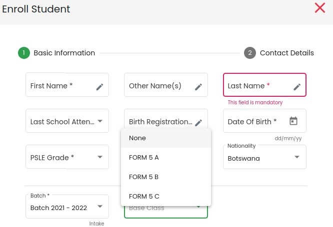

# School Administration

## Introduction
This is a core module that simulate the structures of host schools by defining and handling essential information needed to get the system up and running, as well as supporting other modules. 

## Features

* ### **`Create school profiles`**.
Our system built on a multi-tenant architecture, allowing users to administer more than one school within the same or distinct domains. This feature makes it easy for administrators to define and manage school specific information as well as information/ data that applies to all schools under their administration. 

___
**NOTE**: Domain refers to either primary, junior or senior school in our context.
___

* ### **`Add/ edit domain specific subjects`** 
Subject are created by a privileged user at admin level. When creating a subject, a user link it to a domain, provide a name and subject outline. In the current implementation, subject outline must accomadate all streams of the specified domain.
    * Assignment of subject teachers is done at subject detailed view by a privileged user at school level.

* ### **`Add/ edit academic terms/ semesters`** 
Currently, the defined term applies to all domains. It assumes the start and end date of each academic term is the same for all domains. 

* ### **`Add/ edit batches (intake)`**
In every school, a batch is a collection of pupils who make up the foundation classes. 
    * Base and subject classes are created by a user with specific privileges at school level.
    * Students are enrolled to base classes during or after [registration](/modules/student-management/#enrolment-of-students) by editing student profile and updating base class field as depicted below. 

* Enrolling students into subject classes is carried out at subject class details view. Only students taking that particular subject as an option, will be available for enrollment.i.e, student subject assignment must be done prior to this operation.

