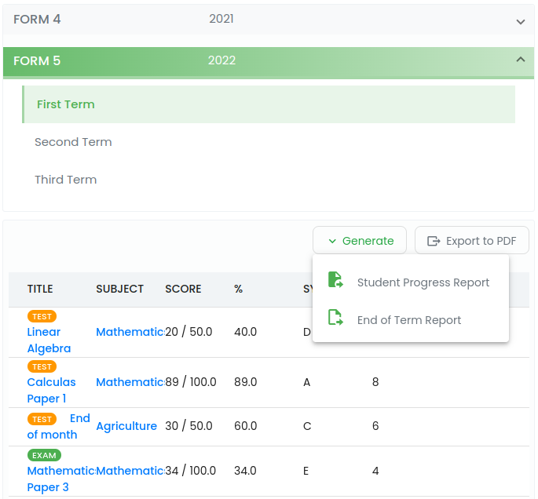

# Student Management

Provide quick and easy access to student particulars, grades, classes and test/ exam schedules as well as progress and end of term reports.

## Features

- [x] **`Enrolment of students`**.
Students are enrolled into batches and base classes during registration. Enrollment into the base class can be done at a later stage by updating student profile.

!!! tip ""
    Select **`Students`** menu under manage students on the main menu. The navigation takes you to a searchable list of students, then click **`Enroll Students`** to register a student. 

- [x] **`Get access to student detailed information/ profile`**

!!! tip ""
    Clicking student name from the list will take the user to a student`s detailed view.

{width="100%"}

The student profile tab shows a list of subjects they are taking. The detailed view of the subject gives privileged users to add/ edit or remove subject from the list of subject taken by the student as well as learning resources. To add subjects, click **`Actions`** button and **`Add Subjects`**.

- [x] **`Access to student assessment records`**.
View term bound assessments results for all kinds of exams taken by the student.e.g. `End of term exams`, `mock exams`, `end of month`, `topic tests`, etc.

- [x] **`Generate student progress and end of term reports`**.

{width="100%"}

---

[View sample report](/sample/report.pdf){ .md-button .md-button--primary }

---

!!! hint 
    Each assessment has a grading scheme which helps in determining the grade symbol and the associated points.