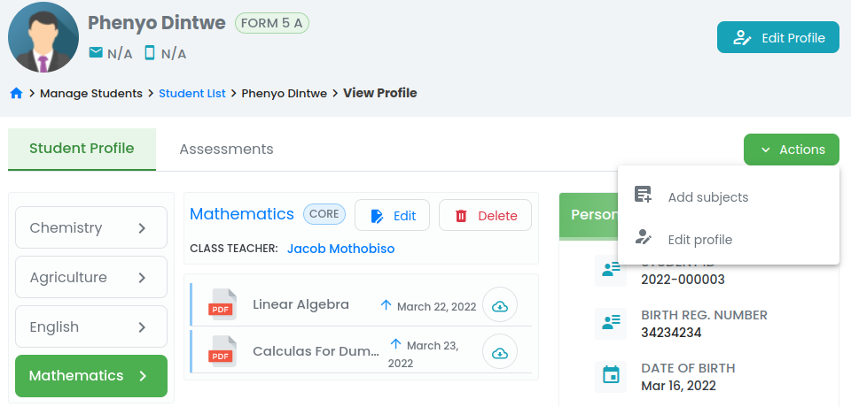

# Student Management

Provide quick and easy access to student particulars, grades, classes and test/ exam schedules as well as progress and end of term reports.

## Features

* ### **`Enrolment of students`**
Students are enrolled into batches and base classes during registration. Enrollment into base class can be done at a later stage by updating student profile.

> Select **`Students`** menu under manage students on the main menu. The navigation takes you to a seachable list of students, then click **`Enroll Students`** to register a student. 

* ### **`Get access to student detailed information/ profile`**

> Clicking student name from the list will take the user to a student  detailed view.

