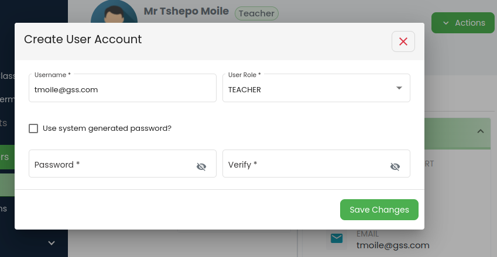
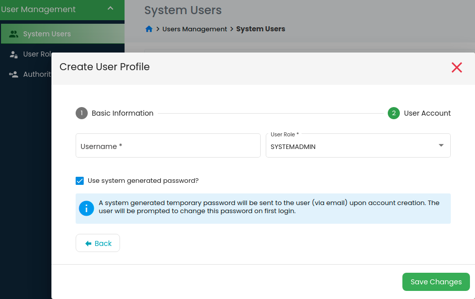

# User Management

## Introduction
This is one of the inherent modules to any system with controlled access. It is responsible to grant different levels of access to various `administration levels`. 

For full documentation visit [mkdocs.org](https://www.mkdocs.org).

## Features

### Authority Group

* `Creating/edit authority group` - Users can group authorities/ access previledges into small, manageable and related fuctionalities according to their needs/ school policies and assign then to different user roles.


---
**NOTE:**
System pre-defined authority-group names cannot be modified as they are treated as special names in the system.
---

### User Roles

`Create/ edit user roles` - In the current version of the system, a user can only have one user role. User roles, on the other hand, are tied to numerous authority groups. 


### System Users

There are two kinds of personnel in the system and their user accounts are created with a somewhat different approaches:

* Creating users from the existing profiles, e.g. `Teachers`. Teachers profiles are created prior to their user accounts. Their profiles exists even if they do not have user accounts. 



Go to teacher profile then `Actions -> Create user account` to create their user account. The email account provide when creating teacher profile will be used as the username. If you opt for system generated password, the system will generate password and send it to the user`s email. You may also create a password for the user and the user will be prompted to change it on first login in both cases
 
* System and school admin users, e.g. `School Admin`, `Bursar`, etc. Their profiles exists because of their user accounts. 



``` To create user, go to system users then add user```.
