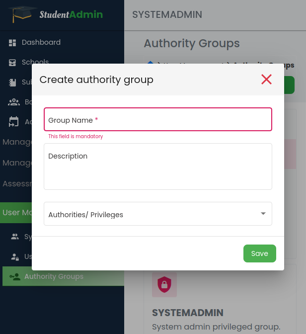

# User Management

## Introduction
This is one of the inherent modules to any system with controlled access. It is responsible to grant different levels of access to various `administration levels`. 

For full documentation visit [mkdocs.org](https://www.mkdocs.org).

## Features

### Grouping Authorities or user previledges

* `Creating/edit authority group` - Users to group authorities/ access previledges into small, manageable and related fuctionalities according to their needs/ school policies and assign then to different user roles.

---
**NOTE:**
System pre-defined authority-group names cannot be modified as they are treated as special names in the system.
---

* `mkdocs serve` - Start the live-reloading docs server.
* `mkdocs build` - Build the documentation site.
* `mkdocs -h` - Print help message and exit.

